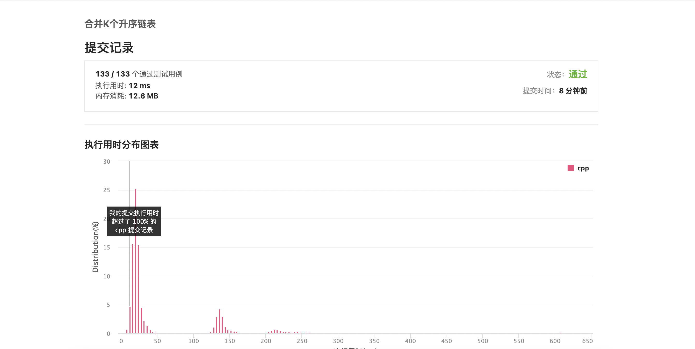

# Leetcode Month1 

## Devide and Conquer

### 1 Merge K Sorted List

#### Ideas:

1. 将所有的链表中的数据遍历一遍，把数据压入最小堆，每次取队头，直到取完。（空间复杂度太大）
2. 将所有的链表的头压入优先队列，每次取出队头时，将链表指针指向下一个结点。（可行，但是懒得手撸小根堆）
3. 循环两两合并，维护一个最长的链表（时间复杂度爆了，每个元素平均会被访问 n/2k 次）
4. 分治，自低向上合成一个链表。（就他了）

#### code

```cpp
/**
 * Definition for singly-linked list.
 * struct ListNode {
 *     int val;
 *     ListNode *next;
 *     ListNode() : val(0), next(nullptr) {}
 *     ListNode(int x) : val(x), next(nullptr) {}
 *     ListNode(int x, ListNode *next) : val(x), next(next) {}
 * };
 */
class Solution {
public:
    ListNode* mergeKLists(vector<ListNode*>& lists) {
        int len = lists.size();
        if (len==0) return nullptr;
        if (len==1) return lists[0];
        return merge(lists, 0 , len-1);
    }

    ListNode * merge(vector<ListNode*> & lists, int le, int ri){
        if(le == ri) return lists[le];
        if(le > ri) return nullptr;
        auto mid = (ri + le) / 2;
        return merge2lists(merge(lists,le,mid),merge(lists,mid+1,ri));
    }

    ListNode* merge2lists(ListNode *a, ListNode *b) { // template
    ListNode head, *tail = &head;
    while (a && b) {
        if ((a->val) < (b->val)) {
            tail->next = a; a = a->next;
        } else {
            tail->next = b; b = b->next;
        }
        tail = tail->next;
    }
    tail->next = (a ? a : b);
    return head.next;
}
};
```

#### Result



#### Improvement

测试样例中的链表条数稍微有点多，至少需要8层递归。可不可以用一个队列来存储已经合并过的链表。每一次只取队头两个，合并后压入队尾，直到队中只有一条链表结束。返回一条链表。


### 2.Median of Two Sorted Arrays
#### ideas :
1. merge this two array and find the median
2. Devide and Conquer

### code
```cpp
    // 这个比想象中难一些，
const int inf = 0xfffffff;
class Solution {
public:
    double findMedianSortedArrays(vector<int>& nums1, vector<int>& nums2) {
        if (nums1.size() > nums2.size()) {
            return findMedianSortedArrays(nums2, nums1);
        }
        
        int m = nums1.size(),n = nums2.size();
        int le = 0, ri = m;
        int median1 = 0, median2 = 0;

        while (le <= ri) {
            int i = (le + ri) / 2;
            int j = (m + n + 1) / 2 - i;

            int nums_im1 = (i == 0 ? -inf : nums1[i - 1]);
            int nums_i = (i == m ? inf : nums1[i]);
            int nums_jm1 = (j == 0 ? -inf : nums2[j - 1]);
            int nums_j = (j == n ? inf : nums2[j]);

            if (nums_im1 <= nums_j) {
                median1 = max(nums_im1, nums_jm1);
                median2 = min(nums_i, nums_j);
                le = i + 1;
            } else {
                ri = i - 1;
            }
        }

        return (m + n) % 2 == 0 ? (median1 + median2) / 2.0 : median1;
    }
};
```
### Result 


### Improvement

暂时还没想出来

