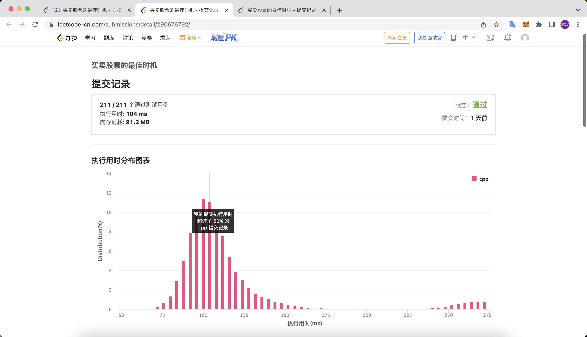
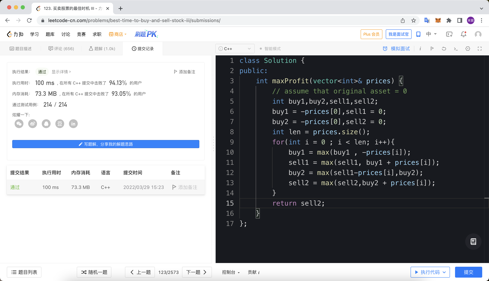

# Month2
## Dynamic Programming
## 背包问题
三种基本的背包问题，已经全部解决在dp文件夹中
## leetcode 115 
### dp写法
```cpp

class Solution {
    
public:
    ulong dp[1010][1010] ={0};
    const long long N = 1e3 +10;
    int numDistinct(string s, string t) {
        if(s.size() < t.size()) return 0;
        auto lent = t.size();
        auto lens = s.size();
        //init 
        for(int i = 0 ; i <= lent; i++) dp[lens][i] = 0;// s[lens:] == None
        for(int i = 0 ; i <= lens; i++) dp[i][lent] = 1;// t[lent:] == None
        //dp
        for(int i = lens-1 ; i>=0 ;i--){
            for(int j  = lent -1; j>=0 ;j--){
                dp[i][j] = dp[i+1][j];
                if (s[i] == t[j]) dp[i][j]+= dp[i+1][j+1];
                // cout << dp[i][j]<< endl;
            }
        }
        return dp[0][0];
    }
};
```

ps:过了，但是时间很难看，况且题目上说的是可以用int过掉，没想到最后还要用unsigned long，debug半天挺无语的。看看能不能学习一下别人的题解改进一下。
ps:ps:看了力扣上面速度超快的题解，发现别人都是特判了最长的数据，并不具有一般性。

## leetcode 152 
### 思路
类似最大子列和，但是要注意到可能出现负负得正的情况，所以在每次计算的时候记录下来所有绝对值大的数（也就是开两个数组，一个记录正的最大，一个记录负的最小），嗯代码第一次写的很简单，交了两发就ac了。但是时间和空间都很难看，尝试优化。
### 第一次ac
```cpp
    class Solution {
public:
    int maxProduct(vector<int>& nums) {
        // 从其数列性质可以看出只需要自底向上算一遍就行了
        vector<int> dpmax(nums);
        vector<int> dpmin(nums);
        for(int i = 1 ; i < nums.size();i++){
            dpmax[i] = max(dpmax[i-1] * nums[i],max(dpmin[i-1]* nums[i],nums[i]));
            dpmin[i] = min(dpmin[i-1] * nums[i],min(dpmax[i-1] * nums[i], nums[i]));
        }
        int res = -0xfffffff;
        for(auto v: dpmax){
            res = max(res,v);
        }
        return res;
    }
};
```

### 第二次ac
思路：其实dpmax和dpmin都是可以去掉的，我们在每一次循环中只需要当前的最大值和最小值，所以只需要两个int变量就可以解决问题。这样在每次循环的时候只需要先判断nums[i]的符号再进行乘法运算就好了。但是改造之后都是O(n)的复杂度。
```cpp

``` class Solution {
public:
    int maxProduct(vector<int>& nums) {
        int maxx = max(1,nums[0]), minn = min(1,nums[0]),ans = nums[0];
        int len = nums.size();// -------------这个变量len是本程序执行的精华，可以达到0ms
        for(int i = 1 ; i < len;i++){
            auto num = nums[i];
            if(num < 0){
                auto t = maxx;
                maxx = max(minn * num, num);
                minn = min(t * num, num);
            }
            else{
                maxx = max(maxx * num, num);
                minn = min(minn * num, num);
            }
            ans = max(maxx,ans);
        }
        return ans;
    }
};
```

**后记** 后面把第一个ac程序加了一个len之后也可以达到0ms。看来是vector.size()太慢了。查了一下cppreference，应该是O（1）的复杂度，不知道为啥能这么慢。无语。以后学会了，每次调用先把这个长度信息存起来。
## 股票收益最大化问题
**一个Quant一定要做一下股票题**
### 股票1
```cpp
class Solution {
public:
    int maxProfit(vector<int>& prices) {
        int len = prices.size();
        int minn = prices[0];
        int res = 0;
        for(int i = 1  ; i < len ;i++){
            minn = min(minn, prices[i]);
            res = max(res, prices[i] - minn);
        }
        return res;
    }
};
```

### 股票2
```cpp
class Solution {
public:
    int maxProfit(vector<int>& prices) {
        int len = prices.size();
        int buy = -prices[0], sell = 0;
        for(int i = 0 ; i < len ;i++){
            buy = max(buy, sell - prices[i]);
            sell = max(buy + prices[i],sell);
        }
        return sell;
    }
};
```


### 股票3
第二题做完之后看了看题解，第三题挺轻松的。主要是区分好第几次进行交易。在第二题（无限次交易）中，只要把第一次和第二次分开就可以变成第三题了。
```cpp
class Solution {
public:
    int maxProfit(vector<int>& prices) {
        // assume that original asset = 0
        int buy1,buy2,sell1,sell2;
        buy1 = -prices[0],sell1 = 0;
        buy2 = -prices[0],sell2 = 0;
        int len = prices.size();
        for(int i = 0 ; i < len; i++){
            buy1 = max(buy1 , -prices[i]);
            sell1 = max(sell1, buy1 + prices[i]);
            buy2 = max(sell1-prices[i],buy2);
            sell2 = max(sell2,buy2 + prices[i]);
        }
        return sell2;
    }
};
```

### leetcode 42
``` cpp
class Solution {
public:
    int trap(vector<int>& height) {
        int len = height.size();
        auto ml = new int[len];
        auto mr = new int[len];
        int tm = -1;
        for(int i = 0 ; i < len ; i++) ml[i] = mr[i] = 0;
        for(int i = 1 ; i < len; i++){
            tm = max(tm, height[i-1]);
            ml[i] = tm;
        }
        tm = -1;
        for(int i = len-2 ;i >= 0 ; i--){
            tm = max(tm, height[i+1]);
            mr[i] = tm;
        }
        int ans = 0;
        for(int i = 1 ; i < len-1 ; i++){
            int res = max(0, min(mr[i], ml[i]) - height[i]);
            ans += res;
        }
        return ans;
    }
};
```

**交了两发就过了。第一发ans没给初始化，真的无语。看了看更牛逼的ac代码发现，只需要两个变量保存左边最高和右边最高就可以了，一个while解决问题。如果左边最高高于右边最高，那么最后的雨水容量就是右边最高减去挡墙高度，反之最后的雨水容量就是当前高度减去左边高度。（木桶效应：只需要看最短的边）**
### leetcode 410
```cpp
class Solution {
public:
    int splitArray(vector<int>& nums, int m) {
        int le = 0, ri = 0;
        for(auto num : nums){
            le = max(num,le);
            ri += num;
        }
        //二分最大值的最小值
        while(le < ri){
            int split = 1;
            int mid = (le + ri) >> 1;
            int sum = 0;
            for(auto num : nums){
                if(sum + num > mid) {split++;sum = 0;}
                sum += num;
            }
            if(split > m) le = mid + 1;
            else ri = mid;
        }
        return le;
    }
};
```

以后最小值的最大和最大值的最小都是这套二分模版，leetcode875也是基本相同的问题。
### leetcode 22 (Templete)
```cpp
class Solution {
public:
    vector<string> generateParenthesis(int n) {
        vector<string> ans;
        dfs(ans,0,0,n,"");
        return ans;
    }
    void dfs(vector<string> &ans, int le, int ri,int n,string s){
        // 2^n model 
        // le->"("  ri ->")"
        if(le > n || ri > le || ri > n) return;
        if(le == n && ri == n) {
            ans.push_back(s);
        }
        else{
            dfs(ans, le+1 ,ri , n ,s+"(");
            dfs(ans, le, ri+1 , n ,s+")");
        }
    }
};
```

中规中矩模版题，子集数模型，带剪枝。当ri!=le时括号的匹配树不平衡，直接剪枝。
