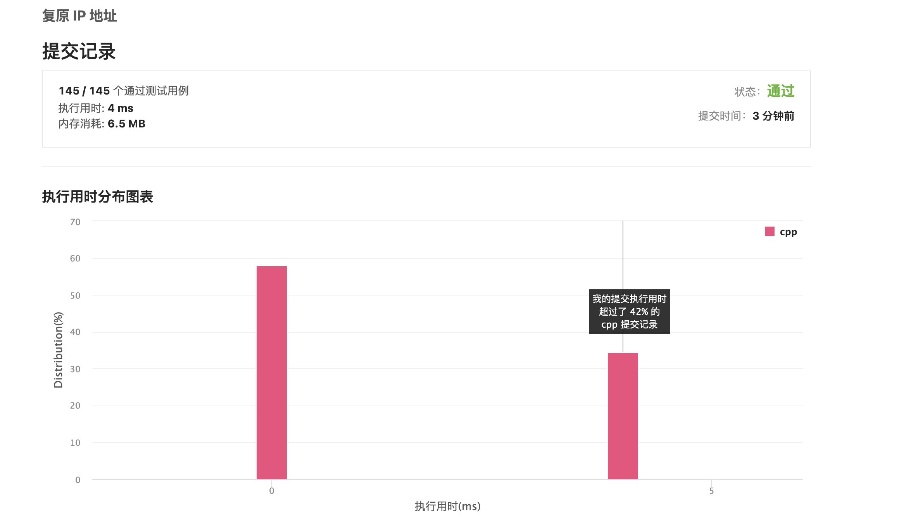

# Month3
### leetcode 93 medium
```cpp
class Solution {
    vector<string> ans;
    vector<int> ip;

public:
    void dfs(const string& s, int cnt, int st) {
        if (cnt == 4) {
            if (st == s.size()) {
                string ipAddr;
                for (int i = 0; i < 4; ++i) {
                    ipAddr += to_string(ip[i]);
                    if (i != 4 - 1) {
                        ipAddr += ".";
                    }
                }
                ans.push_back(move(ipAddr));
            }
            return;
        }
        if (st == s.size()) {
            return;
        }
        else if (s[st] == '0') {
            ip[cnt] = 0;
            dfs(s, cnt + 1, st + 1);
        }
        else{
            int addr = 0;
            for (int end = st; end < s.size(); ++end) {
                addr = addr * 10 + (s[end] - '0');
                if (addr > 0 && addr <= 255) {
                    ip[cnt] = addr;
                    dfs(s, cnt + 1, end + 1);
                } else {
                    break;
                }
            }
        }
    }

    vector<string> restoreIpAddresses(string s) {
        ip.resize(4);
        dfs(s, 0, 0);
        return ans;
    }
};

```
**和时间复杂度低的代码差不多，人家是0ms，我就是4ms，很怪。前导0的剪枝一开始没想到，瞟了一眼答案，最后还是做出来了**



### leetcode 526 medium
```cpp
# include<vector>
# include<cstring>
using namespace std;
class Solution {
public:
    int cnt;
    vector<vector<int >> perm;
    vector<int> v;
    void find_perm(int n){
        perm.resize(n+1);
        for(int i = 1 ; i <= n ; i++){
            for(int j = 1 ; j <= n ; j++){
                if(!(i%j) || !(j%i)) perm[i].push_back(j);
            }
        }
    }

    void back(int lev, int n){
        if(lev > n) {
            cnt ++;
            return;
        }
        for(auto p :perm[lev]){
            if(!v[p]){
                v[p] = 1;
                back(lev+1, n);
                v[p] = 0;
            }
        }
    }

    int countArrangement(int n) {
        find_perm(n);
        v.resize(n+1);
        back(1,n);
        return cnt;
    }
};
```
**排列树的基本框架，但是带了一个优美排列的套路。所以相当于是每一个位置的排列都是有限制的，就是要在整个的排列上加一个限制，全排列的迭代改成因数的vector的迭代就好了**


### leetcode301
```cpp
    class Solution {
public:
    vector<string> res;
    vector<string> removeInvalidParentheses(string s) {
        int le = 0;
        int ri = 0;

        for (char c : s) {
            if (c == '(') {
                le++;
            } else if (c == ')') {
                if (le == 0) ri++; 
                else  le--; //是一个有效的匹配
            }
        }
        back(s, 0, le, ri);
        return res;
    }

    void back(string str, int start, int le, int ri) {
        if (le == 0 && ri == 0) { // 一个有效的匹配
            if (check(str)) {
                res.push_back(str);
            }
            return;
        }
        for (int i = start; i < str.size(); i++) {
            if (i != start && str[i] == str[i - 1]) { // 两个相同没必要继续判断
                continue;
            }
            if (le + i > str.size() - ri) { // 越界了没搜索的必要了
                return;
            } 
            //remove le
            if (le > 0 && str[i] == '(') {
                back(str.substr(0, i) + str.substr(i + 1), i, le - 1, ri);
            }
            // remove ri
            if (ri > 0 && str[i] == ')') {
                back(str.substr(0, i) + str.substr(i + 1), i, le, ri - 1);
            }
        }
    }

    bool check(string  str) {
        int cnt = 0;
        auto len = str.size();
        for (int i = 0; i < len; i++) {
            if (str[i] == '(') {
                cnt++;
            } else if (str[i] == ')') {
                cnt--;
                if (cnt < 0)    return false;
            }
        }
        return cnt == 0;
    }
};
```

**一开始没有考虑越界，后来参考了实例代码，加上了判断，并且对已有代码进行了优化，最后达到了0ms，非常开心**

### leetcode 679 
```c
bool solve(double *l, int sizel) {
    if (sizel == 0)  return false;
    if (sizel == 1) return fabs(l[0] - 24) < 1e-6;
    for (int i = 0; i < sizel; i++) {
        for (int j = 0; j < sizel; j++) {
            if (i != j) {
                double numtemp[20];
                int len = 0;
                for (int k = 0; k < sizel; k++) 
                    if (k != i && k != j)   numtemp[len++] = l[k];
                for (int k = 0; k < 4; k++) {
                    if (k < 2 && i > j) continue;
                    if (k == 0)         numtemp[len++] = l[i] + l[j];
                    else if (k == 1)    numtemp[len++] = l[i] * l[j];
                    else if (k == 2)    numtemp[len++] = l[i] - l[j];
                    else if (k == 3) {
                        if (fabs(l[j]) < 1e-6) continue;
                        numtemp[len++] = l[i] / l[j];
                    }
                    if (solve(numtemp, len)) return true;
                    len--;
                }
            }
        }
    }
    return false;
}

bool judgePoint24(int *nums, int numsSize) {
    double l[20];
    int sizel = 0;
    for (int i = 0; i < numsSize; i++) {
        l[sizel++] = nums[i];
    }
    return solve(l, sizel);
}
```

**这个题，半夜做的，看了看有思路，就直接看的题解。cpp的写法没看懂，直接借鉴的c**

### leetcode135
```cpp
class Solution {
public:
    int candy(vector<int>& ratings) {
        auto len = ratings.size();
        auto left = new int[len]; left[0] = 1;
        auto right = new int[len]; right[len-1] = 1;
        for(int i = 1 ; i < len ; i++){
            if(ratings[i] > ratings[i-1]){
                left[i] = left[i-1]+1;
            }
            else left[i] = 1;
        }
        for(int i = len -2 ; i >= 0 ; i--){
            if(ratings[i] > ratings[i+1]){
                right[i] = right[i+1] + 1;
            }
            else right[i] = 1;
        }
        auto sum = 0;
        for(int i = 0 ; i < len ;i++)
            sum += max(right[i], left[i]);
        return sum;
    }
};
```


与上个月写的接雨水思路相同，但是时间效率上差了很多，看了看题解，发现可以少一次遍历直接用right一个变量解决问题。挺巧妙的，不过思路一样。题解中发现一个评论很有启发性（贪心性质的证明）。
```
我们取序列中的任意两点，A B
1. 如果 A > B ,则按照左规则处理后，B不会比A多；按照右规则处理后，A一定比B多，那么A一定会被更新（变大），但L、R规则仍然成立：B不会比A多，A一定比B多；
2. 同理可讨论 A<B;
3. 当 A == B，A、B的值无论如何更新，都不影响 L、R规则
综上，取最大值后不影响某一规则的成立。

我自己的想法：
肯定是left和right选一个。如果是选小的，另外一个有可能不满足，所以要找充分条件。
```