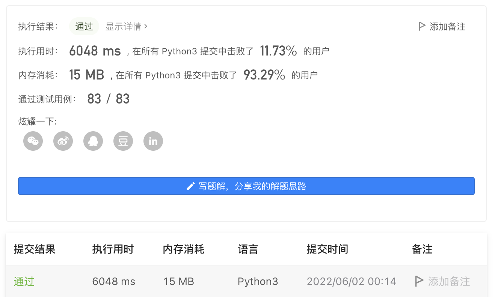
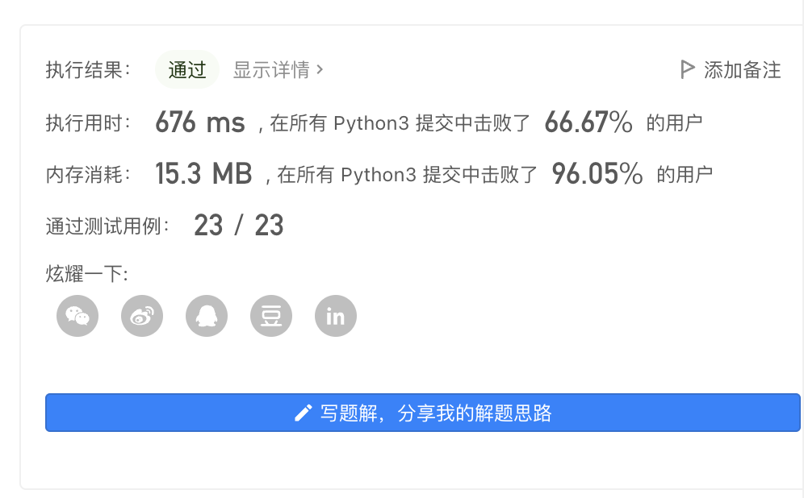

# Month 4
**22920202200764刘本宸**
### leetcode79
```python
class Solution:
    def exist(self, board: List[List[str]], word: str) -> bool:
        # 使用深度优先搜索
        if not board: 
            return False
        for i in range(len(board)):
            for j in range(len(board[0])):
                if self.dfs(board, i, j, word):
                    return True
        return False

    def dfs(self, board, i, j, word):
        if len(word) == 0:
            return True
        if i < 0 or i >= len(board) or j < 0 or j >= len(board[0]) or word[0] != board[i][j]: 
            return False
        tmp = board[i][j]
        board[i][j] = '0' # 不用另外开辟vis数组
        res = False 
        direction = [(0,1),(0,-1),(1,0),(-1,0)]
        for dx, dy in direction:
            res = res or self.dfs(board,i+dx,j+dy,word[1:])

        board[i][j] = tmp
        return res
```

回溯模版题，练练手

### leetcode 282
```python
class Solution:
    def addOperators(self, num: str, target: int) -> list[str]:
        n = len(num)
        ans = []
        def dfs(expr , i , res , mul): # 乘法要因为优先级单独计算
            if i == n:
                if res == target:
                    ans.append(''.join(expr))
                return
            signIndex = len(expr) # 每次在表达式最后添加operator
            if i > 0:
                expr.append('')  
            val = 0
            for j in range(i, n): 
                if j > i and num[i] == '0': 
                    break
                val = int(str(val) + num[j]) # 更新下一个操作数
                expr.append(num[j])
                if i: 
                    expr[signIndex] = '+'
                    dfs(expr, j + 1, res + val, val)
                    expr[signIndex] = '-'
                    dfs(expr, j + 1, res - val, -val)
                    expr[signIndex] = '*'
                    dfs(expr, j + 1, res - mul + mul * val, mul * val)
                else:  # 表达式开头不能添加符号
                    dfs(expr, j + 1, val, val)
            expr = expr[:signIndex]

        dfs([], 0, 0, 0)
        return ans
```

**本题还是回溯法的模版，对标两个题（24点 && 组合）加了两个难点**
1. 乘法的优先级与加减不一样，要做特别的判断
2. 给定的是一个字符串，要做字符串切割和前导0的判断
